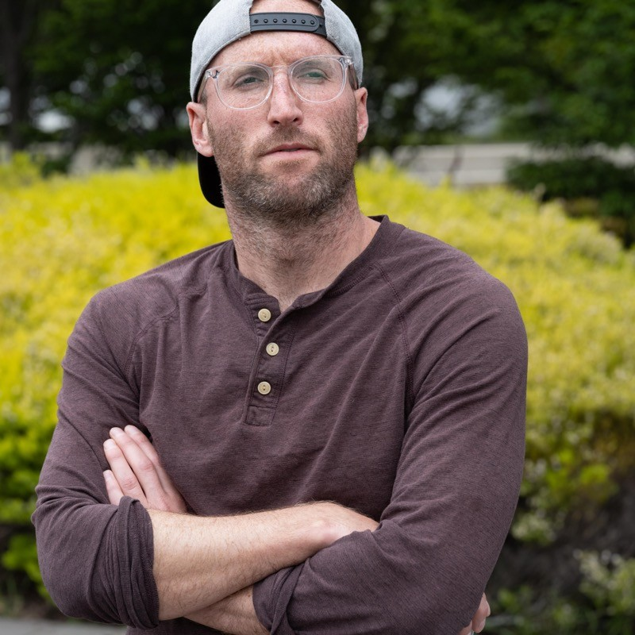
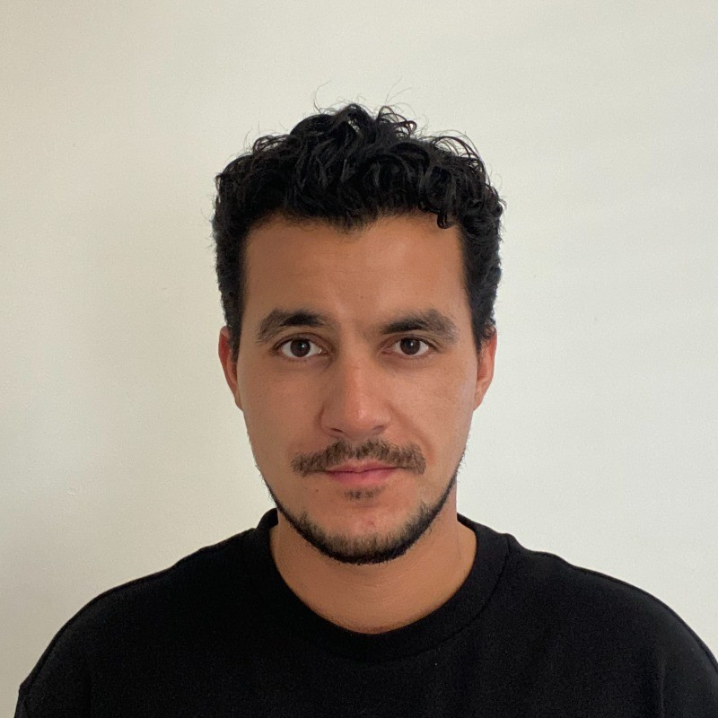

# Team-O — Creative Motion Control Course Site

## Team Members

  
  <h3>Jonathan Crescenzo</h3>
  
<em>MSc / Phd student</em>

  <!-- 
A short bio — background, interests, what you're excited to explore in this course.
 -->

  
  <h3>Italo Rojas</h3>
  
<em>MSc</em>

  <!--
I like to work with audio, nature and sustainable materials.

-->

<!-- Copy the block above to add more team members -->

## Projects

| Project | Description |
|---------|-------------|
| [Road to Edible Patterns](projects/project1/docs/) | *Curve lines pattern with ink* |

<!-- Add rows as you complete more projects:
| [Project 2](projects/project2/docs/) | *Brief description of project 2* |
| [Project 3](projects/project3/docs/) | *Brief description of project 3* |
-->
