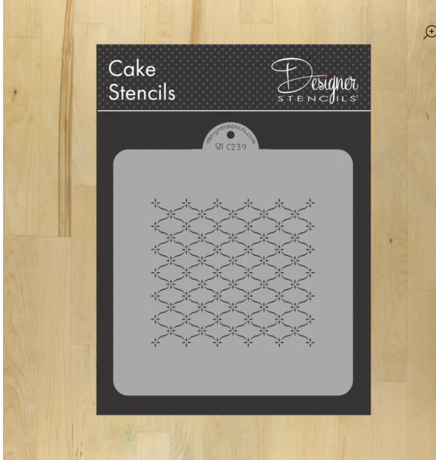
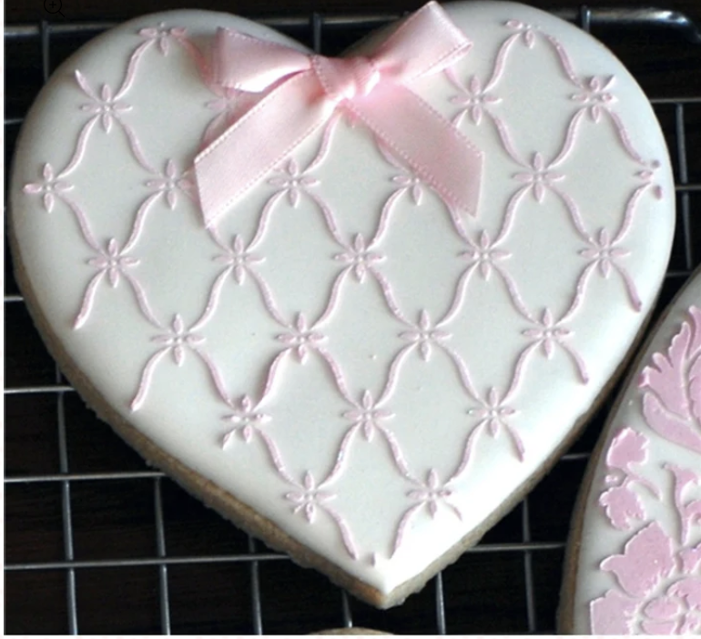
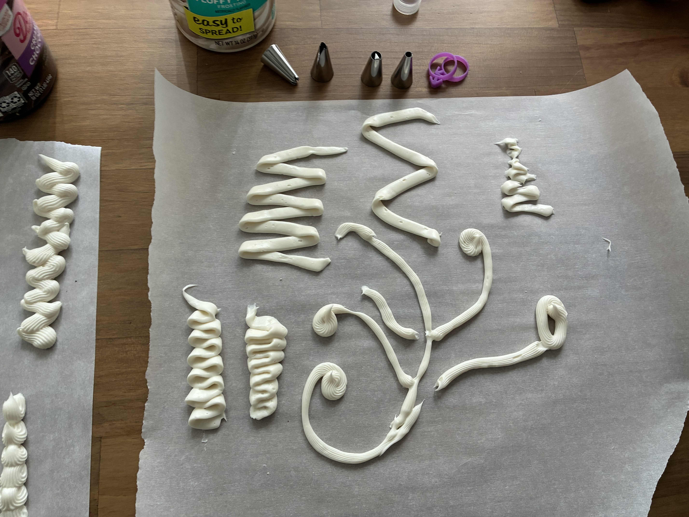
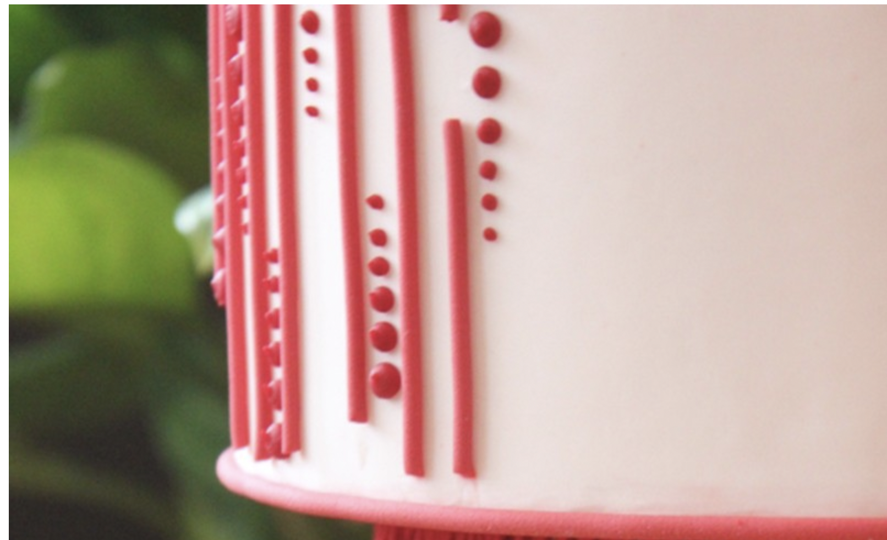
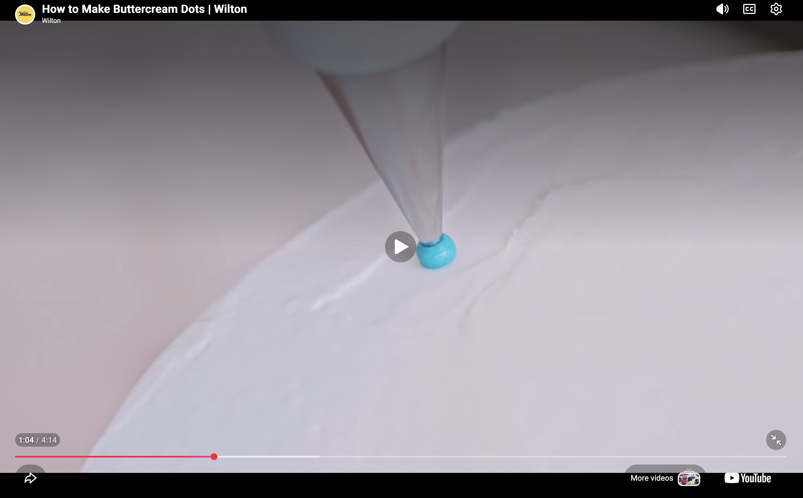
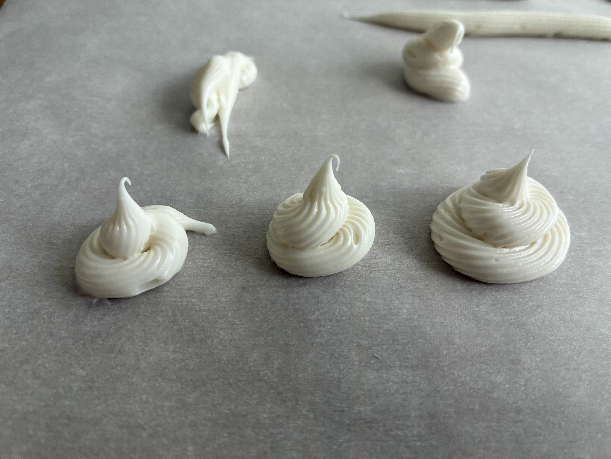
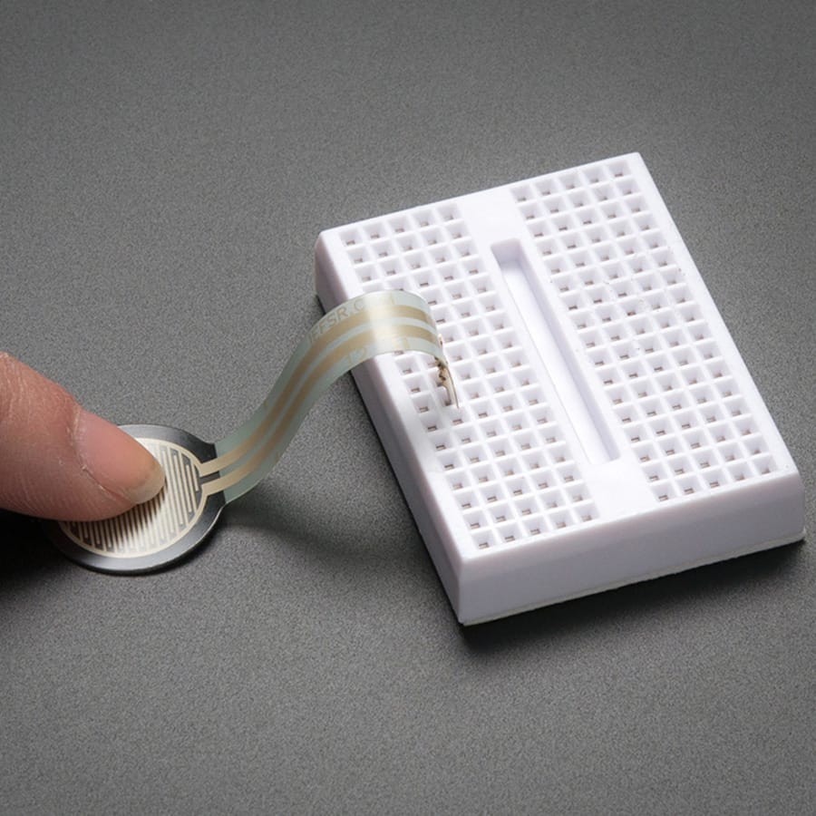
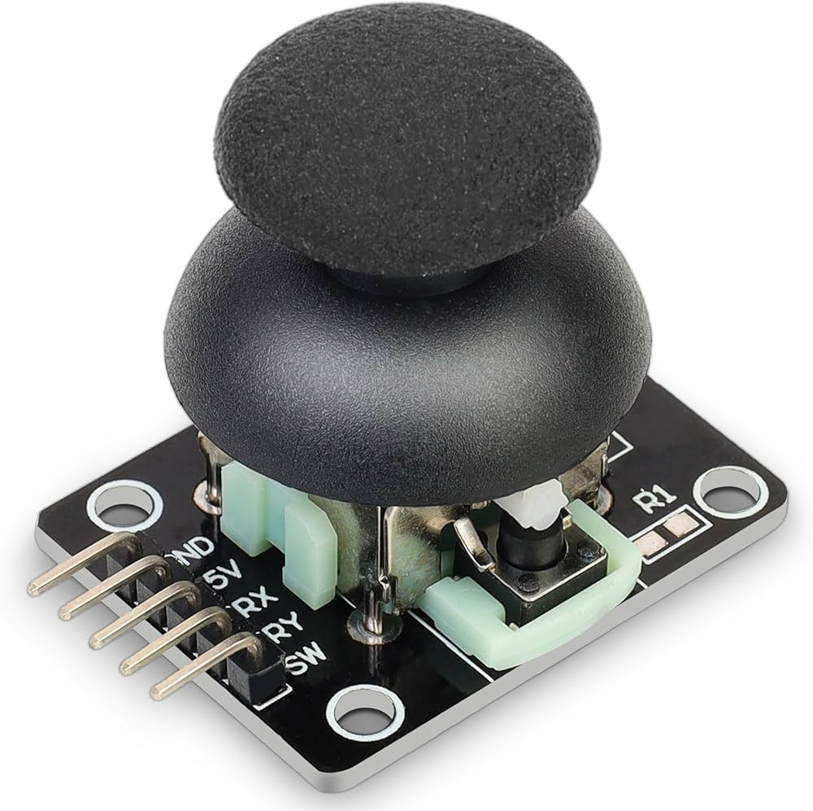

## Design Dimensions
 
 ### 1. Relevance
 Our goal is to enable cake pipers the ability to generate intricate and precise geometric patterns that they are not current capable without machine control. 
 
 We are exploring how this might provide cake pipers with a new tool to expand the types of patterns they can make. 

### 2. Usability 

The machine is intended to create patterns that combines techniques of latticing and with the piping techniques of extruded patterns. Typically latticing uses premade stencils.  This fixed pattern prevents pipers from make variations with the stencil designs without create a new stencil. 

### 3. Responsiveness 
Our goal is to allow cake pipers the ability to generate variable stencils patterns with the liveness ability to change or adjust these patterns. 

For example with a circle pattern, cake pipers can adjust the frequency to create small variations and spikes with a circle that too intricate for the hand. Additionally, they can generate a repeating rings of circles the spiked variations as the pattern is generated. 

## User Research

We practiced piping to get a sense of the hand techniques used in cake decoration and pattern making.

This helped us discern the level difiiculty in translating certain piping techniques to the machine's motion path. That said even simple patterns require intricate and intricate hand manipulation of pressure and subtle changes in the z-axis. 

Different designs are characterized by the noze tip. These create all different kinds of formations and textures to cake decorations. But we noticed that with only two design shapes, we could create intricate patterns. 

### 1. Variables to define a pattern
After watching videos and try making the patterns by ourselves, we discover that we need the following variables to define the pattern.
  - X position
  - Y position
  - Z position
  - Tip type
  - Pressure level (P)

### 2. Selected patterns
We reviewed the following patterns that we extracted from the reference. We classified them into 2 levels.

### Basic patterns

These patterns just use x, y, z and P 

#### Pattern 1: Dot

#### Pattern 2: Lines 

Lines require steady pressure. The shape is determined by the tip type. A common technique is to fold or overlap lines.  

### Intermediate Patterns

The intermediate patterns still place the extrusion tip perpendicular to the surface of the cake. 

#### Pattern 3: Swirls

Swirls require a tight circular motion and elevation on Z axis. 

## Iteration proccess for Extrusion
<!-- We discussed some crazy ideas...

 -->

Reference

 

## "Extrusion" Mechanism Concept
For extrusion, the following mechanism uses a stepper motor to push the syringe. The speed (amount of revolutions) of the stepper motor pushes the syringe plunger, increasing the pressure level.

  A force sensor control is mapped to the stepper motor speed pressuring the machine head to release the material.

### Design and materials
1. Syringe Pump 
https://www.youtube.com/watch?v=CjKRdCHnVno&t=375s
Nema 17 stepper motor,
A4988 stepper motor driver,
3D printer push lever case and 
Flexible coupling 5*8
CNC Sheild,
Screwed shaft.
2 Pistons,
Laser Cut acrylic,

### A4988 Driver Module Control
The driver module requires a 12 voltz plug and a capacitor to prevent spikes and frying the module. 

https://lastminuteengineers.com/a4988-stepper-motor-driver-arduino-tutorial/

Resources: Materials and Models 
https://chem.uncg.edu/croatt/flow-chemistry/building-the-syringe-pump/

## User Interface & User Control

#### Extrusion is controlled by a Force Sensor

 Adafruit Interlink FSR 402 (Round) Force Sensor

#### Position of the extruder is controlled by an analog joystic on the x, y.

KY‑023 Dual Axis PS2 Analog Joystick Module

### 2. Control and parameters and control mechanism (potentiometer, sliders or encoders)

#### Speed X: Amp x, Freq x

#### Speed Y: Amp y, Freq y

#### Z Axis:Freq z, Amp z

## Prototype

# Project Output (By Quarter's End)

Combine geometric shapes through the extrusion of dots and lines. Using Inkscape, geometric shapes will be sent to Stepdance, where the user will adjust the frequency and amplification to create variable line and dots patterns. 

## Problems 
Extrusion amount may be quite limited
Variability in pressure and extrusion.

