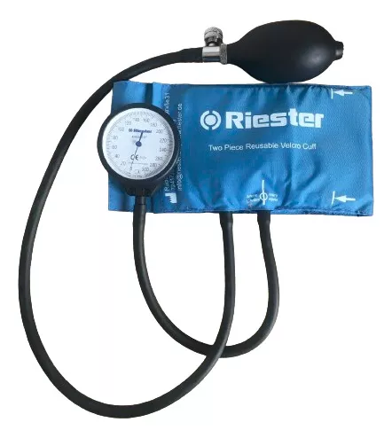
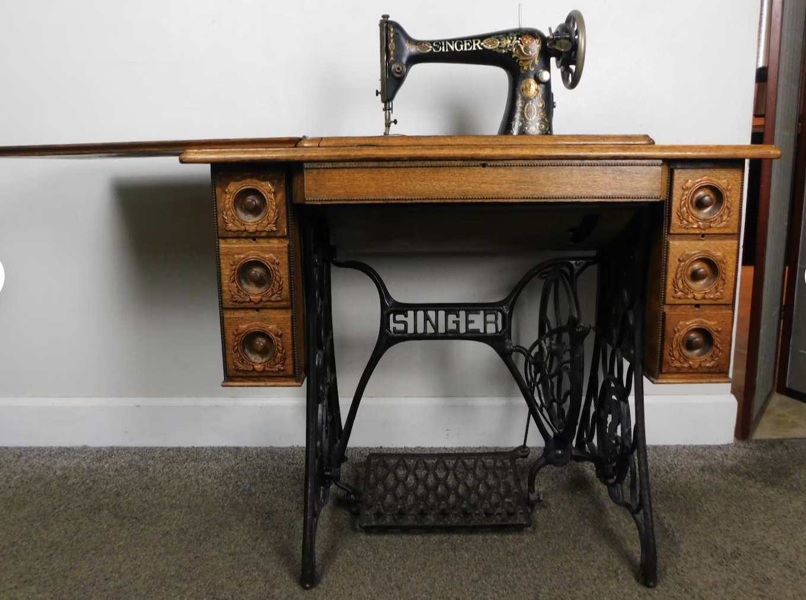
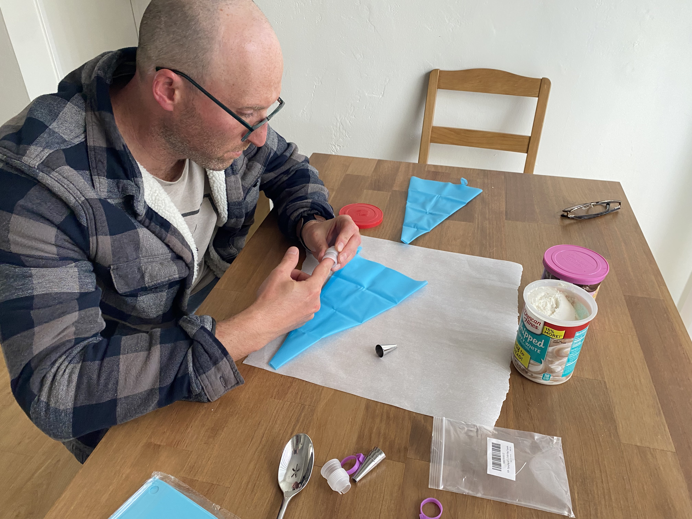
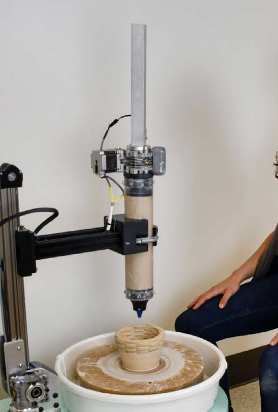
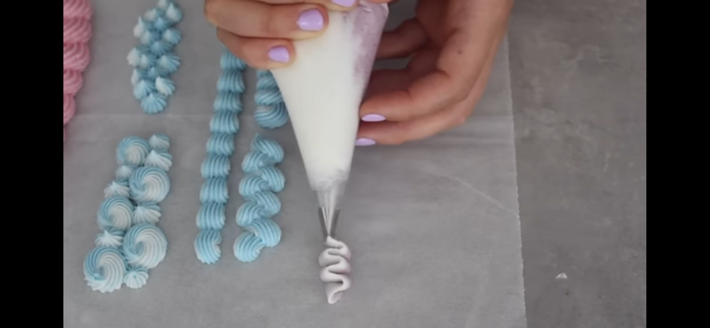
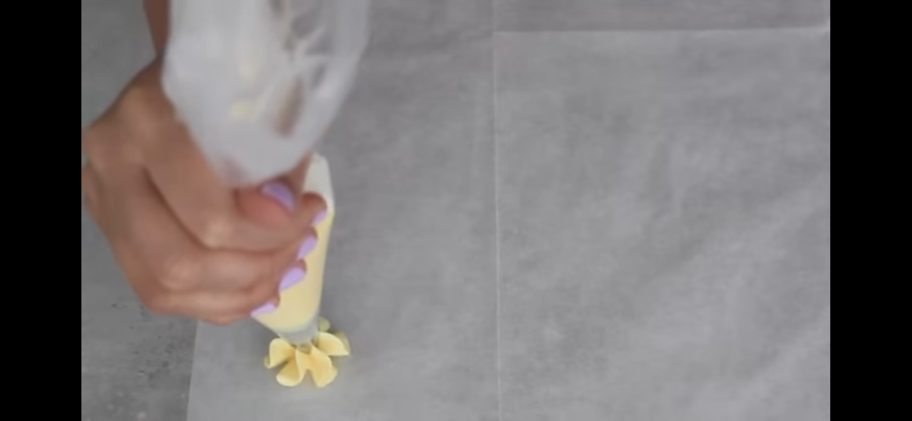
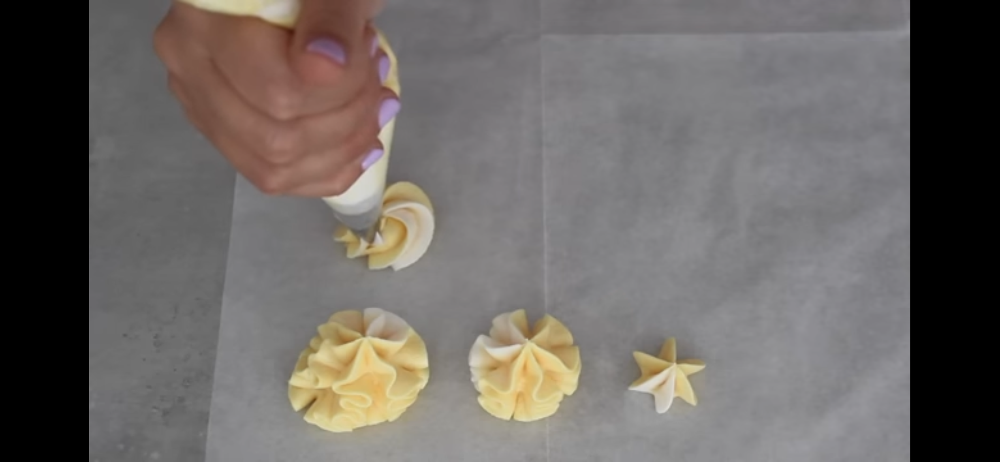
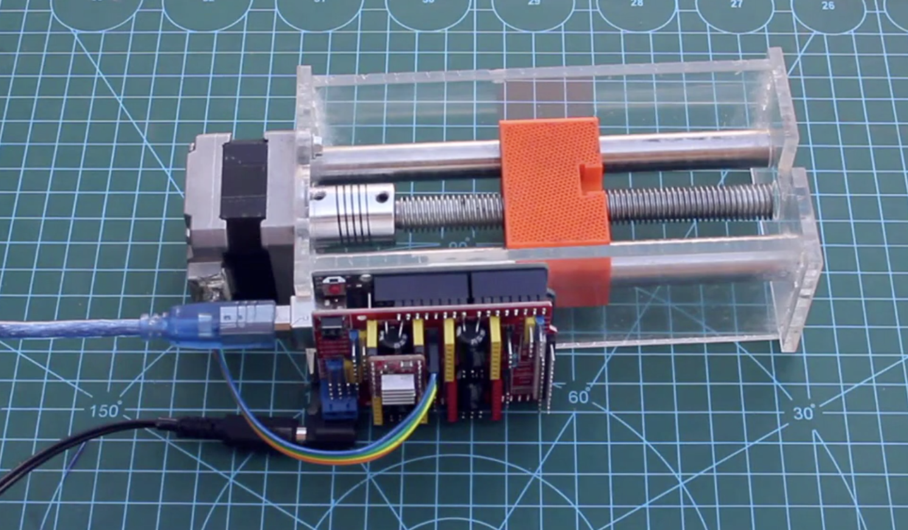
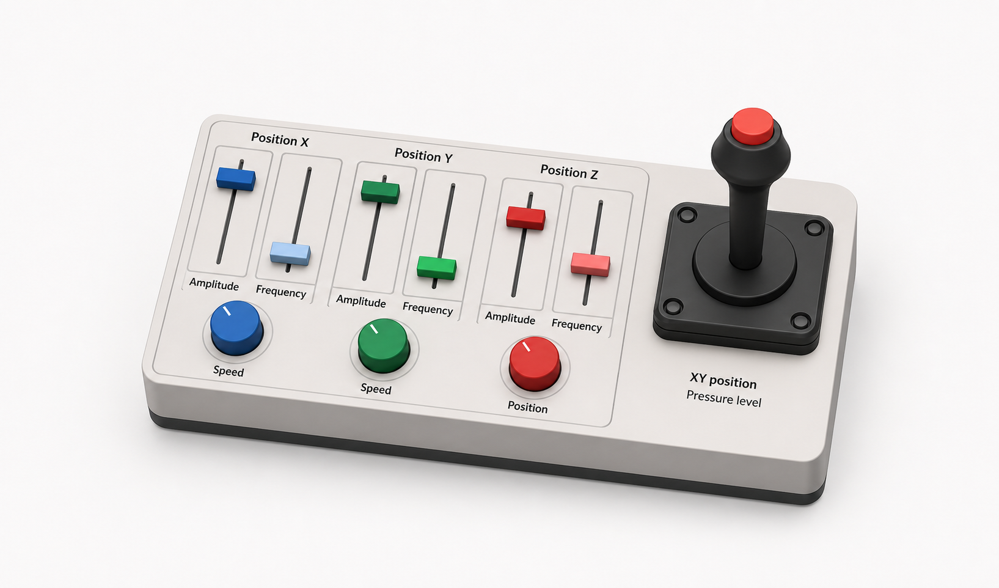
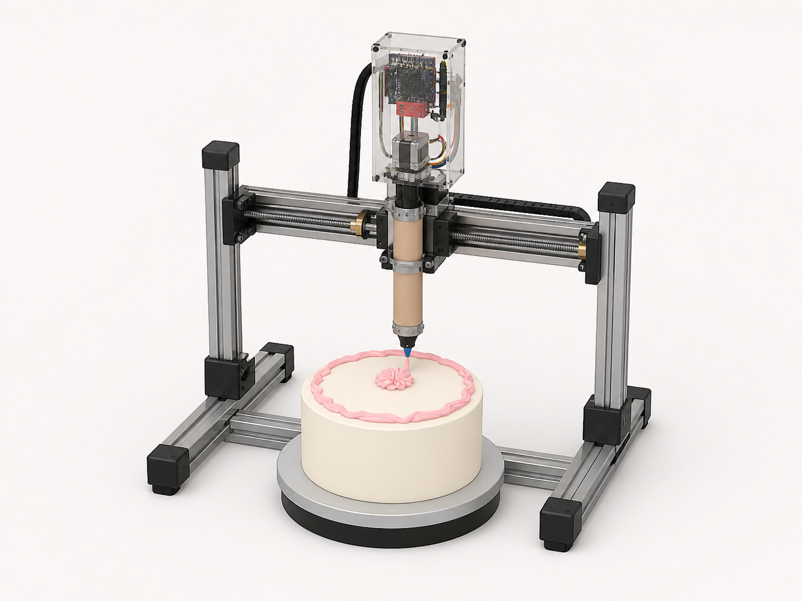

## Iteration proccess
We discussed some crazy ideas...

We try the material to see what happened in the process

## 1. Variables to define a pattern
After watching videos and try making the patterns by ourselves, we discover that we need just the following variables to define the pattern.
  - X position
  - Y position
  - Z position
  - Angle
  - Tip type
  - Pressure level (P)

## 2. Machine head
Same than clay machine but adapted to our case (not extrusion) just a push pump (serynge alike). Reference

## 3. Selected patterns
We decided to work with the following patterns that we extracted from the reference. We classified into 3 levels.

### 1. Basic patterns
This patterns just use x, y, z and P 

#### Pattern 1
##### Reference

##### Try Team-O

#### Pattern 2
##### Reference

##### Try Team-O

#### Pattern 3
##### Reference

##### Try Team-O

### 2. Advanced patterns
This patterns add the angle variable

#### Pattern 4
##### Reference

##### Try Team-O

#### Pattern 5
##### Reference

##### Try Team-O

## 5. User interface 

### Pressure control and "extrusion" mechanism
The pressure level is controlled by a button that uses a force sensor that define how the machine head release the material.

## 6. Design and materials
1. Pressure control
https://www.youtube.com/watch?v=CjKRdCHnVno&t=375s
Nema 17 stepper motor
A4988 stepper motor driver
3D printer part to grab the syringe and store a nut
flexible coupling 5*8
CNC Sheild
Screwed shaft
Linear shaft
Laser Cut acrylic

2. User control part (X, Y and Pressure level)
Adafruit Interlink FSR 402 (Round) Force Sensor
KY‑023 Dual Axis PS2 Analog Joystick Module

3. Other parameters and control mechanism (potentiometer, sliders or encoders)
Speed X
Speed Y
amp x
freq x
amp y
freq y
z axis
freq z
amp z
anlge alpha
angle betha

## 7. Prototype

