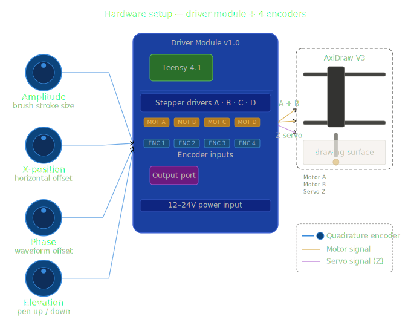
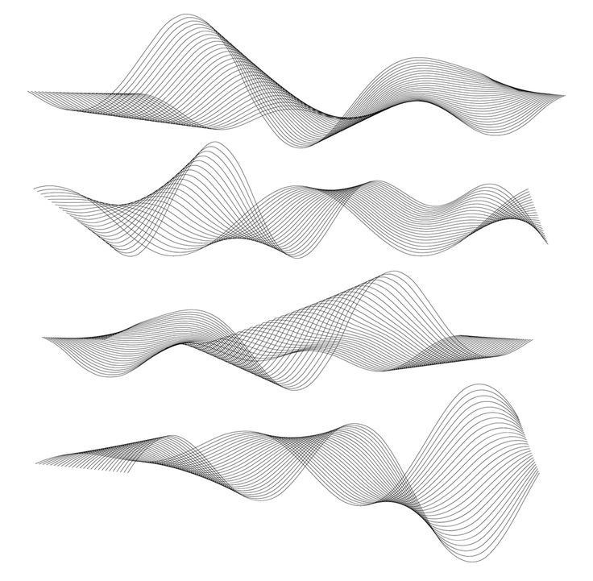
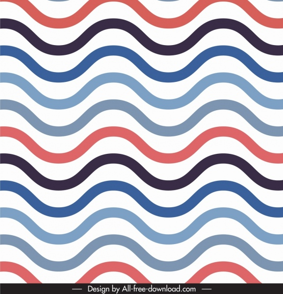

# Project 1: Road to dible Patterns

## Concept

Road to Edible Patterns uses sine waves to create 2D sine wave art patterns in Japanese sumi ink. Using sine waves as the default pattern and continuous motion of the plotter, users will use knobs to control the phase, amplitude, and position (x, y) of the plotting device as it paints. A fourth knob allows the user to adjust the plotter's height. Taking inspiration from the hand techniques of piping in cake decoration and the generative process of suminagashi (floating ink art), it uses sine waves and curved patterns. At the same time, users reshape the programmed pattern to create asymmetrical designs as they choose.

## Design

At first, we gathered all of the ideas. Some of them were:
1. Create curves with edible materials to decorate cakes.
2. Create 3D printing for edible materials
3. Ink art with brushes to simulate bamboo branches
4. Circles

After that, we decided to be more careful in milestone one and learn about the process and the software and hardware. Once that is solved, then we might try with more complex materials that require other tools.

## Implementation

We would like to start from the tutorial and then add more encoders to add more knobs. We first created a simulation of the hardware and knobs to see if the result was good enough. we did this using Claude Sonnet 4.6. The arduino code is in development.

<video width="560" controls>
  <source src="assets/simulation-tool.mov" type="video/mp4">
</video>


### Hardware Setup

4 rotary encoders (left) — each labeled with its role (amplitude, x-position, phase, elevation) and wired via blue lines into the four encoder input ports (ENC 1–4) on the board.

Driver Module board (center) — simplified to show version the Teensy 4.1, the stepper driver row, the encoder input connectors, and the output port. The orange motor connectors (MOT A–D) and purple output port map to the physical board layout.

AxiDraw V3 (right) — receives motor A and B signals (orange) for the gantry axes and a servo Z signal (purple) for pen up/down.



### Code Overview

The key part is the sine wave as a function.

```cpp
// Y is purely a function of X — no independent Y encoder needed
y = amplitude * sin((2 * PI * x) / wavelength);

float x_position;   // encoder 1 — horizontal progress (mm)
float amplitude;    // encoder 2 — sine wave height (mm)
float phase;        // encoder 3 — horizontal shift of the wave
float elevation;    // encoder 4 — vertical offset (lifts/lowers the whole wave)

float computeY(float x, float amplitude, float phase, float elevation) {
    return amplitude * sin((TWO_PI * x / WAVELENGTH) + phase) + elevation;
}

// After computing x and y from the formula above:
channel_a.input_target_position = x + y;   // CoreXY sum
channel_b.input_target_position = x - y;   // CoreXY difference

// When phase encoder changes:
float new_y = computeY(current_x, amplitude, phase, elevation);
// update channel targets immediately

channel_z.input_target_position = elevation;  // maps directly to servo

void loop() {
    float x   = encoder_1.output.get_value();
    float amp  = BASE_AMPLITUDE + encoder_2.output.get_value();
    float ph   = encoder_3.output.get_value();   // radians
    float elev = encoder_4.output.get_value();

    float y = computeY(x, amp, ph, elev);

    channel_a.input_target_position = x + y;
    channel_b.input_target_position = x - y;
    channel_z.input_target_position = elev;

    dance_loop();
}

// Made with Claude Sonnet 4.6

```

## Results

Examples





<!--

Show your project in action. Embed a video of it working:

<iframe width="560" height="315" src="https://www.youtube.com/embed/VIDEO_ID" frameborder="0" allowfullscreen></iframe>

*Replace the iframe above with your actual video URL, or use a local video:*

<video width="560" controls>
  <source src="assets/demo-video.mp4" type="video/mp4">
</video>

## Reflection

What did you learn? What would you do differently?
-->
