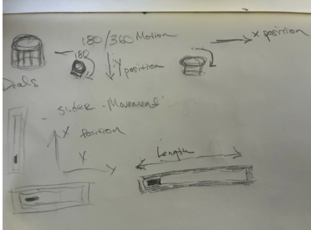
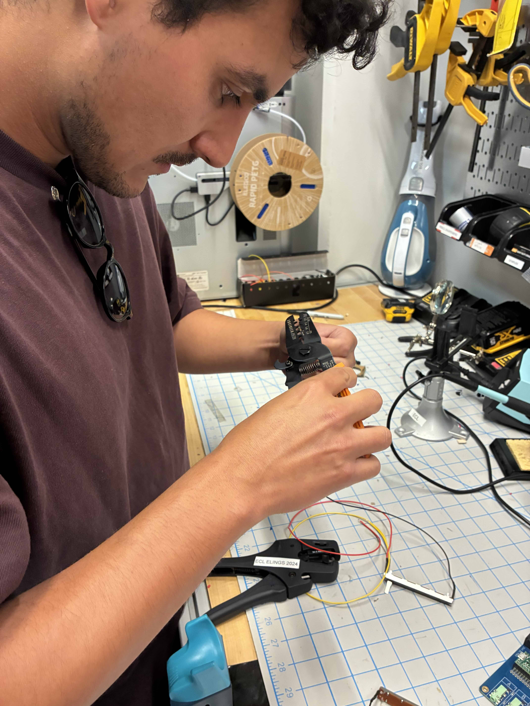

# Project 1: Road to Edible Patterns

## Concept

Road to Edible Patterns uses sine waves to create 2D sine wave art patterns. Using sine waves as the default pattern and continuous motion of the plotter, users will use knobs to control the phase, frequency, amplitude, and position (x, y) of the plotting device as it paints. Taking inspiration from the hand techniques of piping in cake decoration and the generative process of suminagashi (floating ink art), it uses sine waves and curved patterns. At the same time, users reshape the programmed pattern to create asymmetrical designs as they choose.

## Design and Goals

Our goal was to translate the actions and design patterns of cake piping into a drawing tool. We approached this with the initial focus on enabling the user to generate wave patterns, where they controlled the positioning, speed, and shape of the wave.

Users are able to create continuous and looping sine wave patterns of line art.

We used Stepdance's WaveGenerator1D as our starting point and created a series of user controls.

### Controls

Two encoders control the overall position for setting the head, mapped to x and y coordinates respectively.

Frequency and amplitude are controlled by two separate sliders and move on the horizontal x-axis.

Speed is controlled by a potentiometer, allowing the user to control the vertical drawing direction in either direction (positive or negative). A zero value places the tool at rest.

We did not set any limiters within Stepdance to restrict the machine length in either direction, forcing users to stop, reposition, and reverse direction.

In effect we give or force users to manipulate all the controls, which highlights an important area of user interaction design we need to explore with our next iteration. The current setup encourages the user to keep speed controls lower in order to keep track of the surface area and prevent the machine from hitting against the machine edge. Additionally the user has to keep track of 5 separate controls. Too much user control can be burdensome and/or confusing.

### Proposed Interface and Design

Our initial design inspiration is from Video and Audio Synthesizers for the interface and control design. Sliders are often used in audio production to increase amplification, while in traditional video synthesizers knobs are used for positioning and manipulation of frequencies.

Since the Stepdance library has examples using the encoders for positioning, we started with dials, although we plan to explore the use of alternatives.

Initially we thought that the design would include a speed that controlled x and y speed separately, but realized this would conflict with adjusting the frequency and amplitude of sine waves generated on the horizontal axis.

In prototyping we discovered that controlling the speed on the vertical axis could be reversed by giving a negative value to the speed generator floor value. We also discovered that control over low speed allows for fine detail and intricate design, while higher speeds can create larger wave patterns that we suspect will enable larger volumetric movement in a future subtractive or extruding machine.




## Implementation

We started from the tutorial and then added more encoders to add more knobs. We first created a simulation of the hardware and knobs to see if the result was good enough. We did this using Claude Sonnet 4.6.

<video width="560" controls>
  <source src="assets/simulation-tool.mov" type="video/mp4">
</video>

### Hardware Setup

2 encoders (x and y position)
2 sliders (analog channels) to map frequency and amplitude
1 potentiometer (speed) to control the speed for y axis (Also control the direction when changing between positive and negative)
1 button (up/down)


### Code Overview

The key part is the sine wave as a function.

```cpp
// -- Velocity Generator (controls Y-axis speed) --
VelocityGenerator speed_y_gen;

// -- Wave Generator (sine wave on X axis) --
WaveGenerator1D y_wave_gen;

// -- Potentiometer to control speed y --
AnalogInput speed_potentiometer_a1;

// ...

// -- Configure the velocity generator --
speed_y_gen.begin();
speed_y_gen.speed_units_per_sec = 0.0;
speed_y_gen.output.map(&axidraw_kinematics.input_y);

// -- Configure the wave generator --
y_wave_gen.setNoInput();      // use internal clock as time variable
y_wave_gen.frequency = 5.0;  // frequency of oscillation
y_wave_gen.amplitude = 0.0;  // start at 0, change through serial
y_wave_gen.output.map(&axidraw_kinematics.input_x);
y_wave_gen.begin();

// -- Configure the speed potentiometer --
speed_potentiometer_a1.begin(IO_A1);
speed_potentiometer_a1.set_floor(-15);
speed_potentiometer_a1.set_ceiling(15);
speed_potentiometer_a1.set_deadband(1, 509, 4);
speed_potentiometer_a1.map(&speed_y_gen.speed_units_per_sec);

// ...

void set_speed_y(float32_t speed_y) {
    speed_y_gen.speed_units_per_sec = speed_y;
}

void set_y_amplitude(float32_t amplitude) {
    y_wave_gen.amplitude = amplitude;
}

void set_y_frequency(float32_t frequency) {
    y_wave_gen.frequency = frequency;
}
```

## Results




<video width="560" controls>
  <source src="assets/final_controls.mp4" type="video/mp4">
</video>

<video width="560" controls>
  <source src="assets/final_result.mp4" type="video/mp4">
</video>

## Next Steps

Based on the feedback in class and both our goals, we are likely to move forward with an expansion of Project 1. Our goal is to develop a tool which designs and uses edible materials. Our colleagues have highlighted different approaches to achieve this, such as subtractive design rather than extrusion.

Additionally, we are currently researching how to use Polar coordinates system. The ability to make circles and circular patterns is essential to motion in cake decoration and piping.
